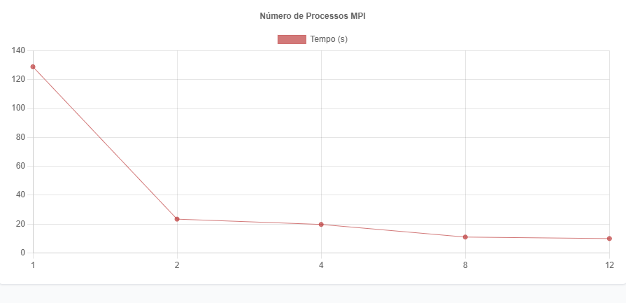
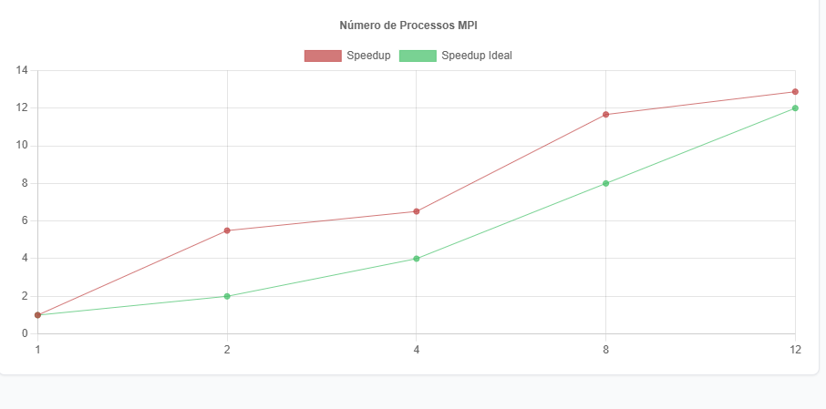
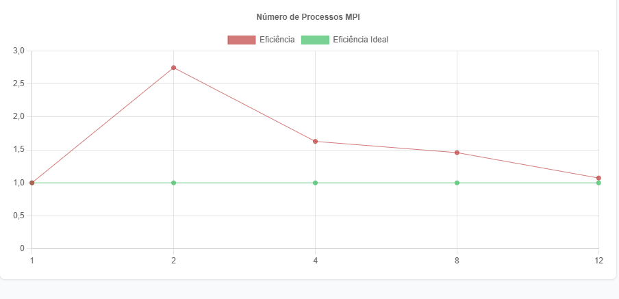

# Relatório de Comparação de Pares com MPI

**Disciplina:** Programação Paralela e Distribuída
**Aluno(s):** _(preencher)_
**Turma:** _(preencher)_
**Professor:** _(preencher)_
**Data:** _(preencher)_

---

# 1. Descrição do Problema

O programa implementa a **comparação exaustiva de pares** entre um conjunto de vetores, calculando a similaridade (ou distância) entre todos os pares possíveis de um corpus de dados. Com aproximadamente 10.000 vetores como entrada, o número total de pares únicos avaliados é C(10.000, 2) ≈ **49.990.000 pares**, o que caracteriza uma carga computacional de complexidade **O(n²)**.

O algoritmo divide o espaço de pares entre os processos MPI disponíveis de forma estática, de modo que cada processo avalia uma fração igual da carga total (12.497.500 pares por processo). O objetivo da paralelização é reduzir o tempo de execução distribuindo o trabalho de comparação entre múltiplos processos, explorando paralelismo de dados.

**Respostas às questões orientadoras:**

- **Objetivo do programa:** Avaliar todos os pares possíveis de um conjunto de vetores, computando métricas de similaridade (ex.: distância euclidiana ou similaridade de cosseno) para cada par.
- **Volume de dados processado:** ~49.990.000 pares avaliados no total (entrada com ~10.000 vetores).
- **Algoritmo utilizado:** Comparação exaustiva de pares (*all-pairs comparison*), com particionamento estático da carga entre processos MPI.
- **Complexidade aproximada:** O(n²), onde n é o número de vetores de entrada.

---

# 2. Ambiente Experimental

| Item                        | Descrição                              |
| --------------------------- | -------------------------------------- |
| Processador                 | _(preencher — ex.: Intel Core i7)_     |
| Número de núcleos           | _(preencher — ex.: 8 núcleos físicos)_ |
| Memória RAM                 | _(preencher — ex.: 16 GB)_             |
| Sistema Operacional         | _(preencher — ex.: Ubuntu 22.04)_      |
| Linguagem utilizada         | C / C++                                |
| Biblioteca de paralelização | MPI (Message Passing Interface)        |
| Compilador / Versão         | _(preencher — ex.: mpicc / GCC 11.4)_  |

---

# 3. Metodologia de Testes

O tempo de execução foi medido do início da fase de comparação até o término do processamento, utilizando `MPI_Wtime` para a versão paralela e `clock_gettime` (ou equivalente) para a versão serial.

A entrada utilizada foi a mesma em todas as configurações — corpus de ~10.000 vetores, totalizando ~49.990.000 pares. A divisão de carga entre processos MPI foi feita de forma estática, com cada processo recebendo 12.497.500 pares para avaliar.

### Configurações testadas

| Configuração          | Pares por processo |
|-----------------------|--------------------|
| 1 processo (serial)   | 49.990.000         |
| 2 processos (MPI)     | 12.497.500         |
| 4 processos (MPI)     | 12.497.500         |
| 8 processos (MPI)     | 12.497.500         |
| 12 processos (MPI)    | 12.497.500         |

### Procedimento experimental

- Número de execuções por configuração: _(preencher — ex.: 3 execuções, média aritmética)_
- Máquina utilizada em modo dedicado para evitar interferência de outros processos.
- A divisão de carga entre processos MPI foi feita de forma estática.

---

# 4. Resultados Experimentais

| Nº Processos MPI | Tempo de Execução (s) |
| ---------------- | --------------------- |
| 1                | 128,86                |
| 2                | 23,46                 |
| 4                | 19,79                 |
| 8                | 11,05                 |
| 12               | 10,01                 |

---

# 5. Cálculo de Speedup e Eficiência

## Fórmulas Utilizadas

### Speedup

```
Speedup(p) = T(1) / T(p)
```

Onde:

- **T(1)** = tempo da execução serial
- **T(p)** = tempo com p processos

### Eficiência

```
Eficiência(p) = Speedup(p) / p
```

Onde:

- **p** = número de processos MPI

---

# 6. Tabela de Resultados

| Processos MPI | Tempo (s) | Speedup  | Eficiência |
| ------------- | --------- | -------- | ---------- |
| 1             | 128,86    | 1,00     | 1,00       |
| 2             | 23,46     | **5,49** | **2,74**   |
| 4             | 19,79     | **6,51** | **1,63**   |
| 8             | 11,05     | **11,66**| **1,46**   |
| 12            | 10,01     | **12,87**| **1,07**   |

**Cálculos detalhados:**

```
Speedup(2)  = 128,86 / 23,46 = 5,49    Eficiência(2)  = 5,49  / 2  = 2,74
Speedup(4)  = 128,86 / 19,79 = 6,51    Eficiência(4)  = 6,51  / 4  = 1,63
Speedup(8)  = 128,86 / 11,05 = 11,66   Eficiência(8)  = 11,66 / 8  = 1,46
Speedup(12) = 128,86 / 10,01 = 12,87   Eficiência(12) = 12,87 / 12 = 1,07
```

> **Observação:** O speedup supera o ideal linear em todas as configurações, caracterizando **speedup superlinear** em todo o intervalo testado. Esse comportamento é discutido na Seção 10.

---

# 7. Gráfico de Tempo de Execução

- Eixo X: número de processos MPI (1, 2, 4, 8, 12)
- Eixo Y: tempo de execução (segundos)
- Observar a queda de 128,86 s → 10,01 s



---

# 8. Gráfico de Speedup

- Eixo X: número de processos MPI
- Eixo Y: speedup
- Linha de speedup ideal (linear) incluída para comparação
- Todos os pontos ficam **acima** da linha ideal, evidenciando superlinearidade



---

# 9. Gráfico de Eficiência

- Eixo X: número de processos MPI
- Eixo Y: eficiência
- Linha de eficiência ideal (= 1,0) incluída para comparação
- Eficiência decresce de 2,74 (p=2) até 1,07 (p=12), permanecendo acima de 1,0 em todo o intervalo



---

# 10. Análise dos Resultados

## Speedup obtido vs. ideal

Em todas as configurações testadas, o speedup obtido supera o speedup ideal linear, caracterizando **speedup superlinear** consistente. Os valores variam de 5,49× com 2 processos até 12,87× com 12 processos, enquanto os valores ideais seriam 2,00× e 12,00× respectivamente.

## Causa provável do speedup superlinear

A explicação mais plausível está no comportamento do **cache de memória**:

- Na execução serial, o processo único manipula ~49.990.000 pares — um volume de dados muito superior à capacidade das caches L1/L2/L3, causando frequentes *cache misses* e alta latência de acesso à memória.
- Com múltiplos processos MPI, cada processo opera sobre apenas **12.497.500 pares**, um volume que cabe melhor nas camadas de cache disponíveis, reduzindo drasticamente os *cache misses* e acelerando o acesso à memória além do esperado pela simples divisão de carga.

Outros fatores que contribuem:

- **Localidade de dados:** cada processo MPI opera sobre uma partição contígua dos vetores, favorecendo a reutilização de dados na cache local.
- **Overhead MPI baixo:** a comunicação entre processos é mínima — apenas a coleta de resultados parciais ao final — tornando o custo de coordenação insignificante frente ao ganho de cache.

## Escalabilidade e queda de eficiência

O programa demonstra **boa escalabilidade** no intervalo testado — o speedup cresce monotonicamente de 5,49× (p=2) a 12,87× (p=12). Contudo, a **eficiência cai consistentemente**, passando de 2,74 para 1,07 conforme o paralelismo aumenta. Isso indica que o ganho marginal de cada processo adicional vai diminuindo.

O ponto mais crítico é a transição de 8 para 12 processos: o speedup cresce apenas de 11,66× para 12,87× (+1,21), enquanto o ideal seria crescer de 8,00× para 12,00× (+4,00). Isso sugere que, a partir de 8 processos, o overhead de comunicação MPI e a contenção de recursos começam a pesar de forma mais significativa.

## Relação com o número de núcleos físicos

Se o número de processos ultrapassar o número de núcleos físicos disponíveis, haverá **contenção de CPU** e o desempenho pode degradar. Com 12 processos, dependendo do hardware utilizado, é possível que já haja sobrecarga de escalonamento. Preencher a Seção 2 com o número real de núcleos ajuda a interpretar este comportamento.

---

# 11. Conclusão

O experimento demonstrou ganho expressivo e consistente de desempenho com a paralelização via MPI. O tempo de execução reduziu de **128,86 s** (serial) para **10,01 s** com 12 processos, representando um speedup de **12,87×** — superior ao ideal em todas as configurações, evidenciando speedup superlinear ao longo de todo o intervalo testado.

O principal fator para esse resultado é o **efeito de cache**: ao dividir o espaço de pares entre os processos, cada processo opera sobre um volume menor de dados, reduzindo *cache misses* e latências de acesso à memória além do que a simples divisão de carga explicaria.

A eficiência, embora sempre superior a 1,0, cai de 2,74 (p=2) para 1,07 (p=12), indicando retornos decrescentes com o aumento do paralelismo. O melhor custo-benefício entre speedup e eficiência foi observado em **p=2** (maior eficiência: 2,74) e **p=8** (melhor relação entre ganho absoluto e uso de recursos). Com 12 processos o ganho marginal já é pequeno, sugerindo que este pode ser o limite prático para esta carga de trabalho no hardware utilizado.

Melhorias possíveis na implementação:

- Avaliar o uso de **OpenMP + MPI** (paralelismo híbrido) para aproveitar tanto os múltiplos núcleos quanto a memória compartilhada intra-nó.
- Implementar balanceamento de carga dinâmico para evitar ociosidade caso a divisão estática não seja uniforme.
- Testar com entradas maiores (ex.: 50.000 vetores) para verificar se a superlinearidade se mantém à medida que o volume de dados por processo cresce.

---
